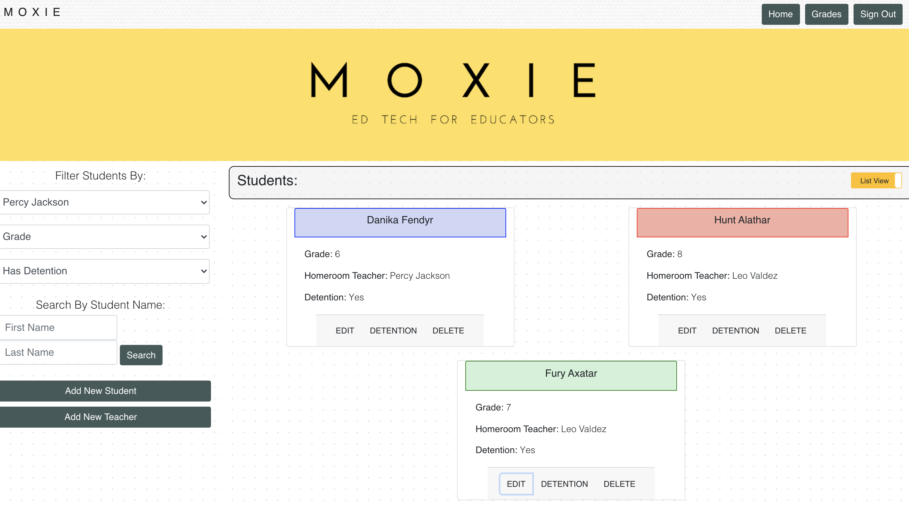

# Moxie
## Table of Contents 
* [Deployed Site](#deployed-site)
*  [Description](#description)
    *  [Logging In](#logging-in)
    *  [Home Page](#home-page)
    *  [Grades Page](#grades-page)
*  [Technologies Used](#technologies-used)
*  [Have Questions?](#have-questions)

## Deployed Site

    https://fathomless-hamlet-31566.herokuapp.com/

## Description

    Any second with your attention away from your students means sacrificing control of your classroom. Moxie streamlines those times when it is necessary for an educator to take their attention off of their classroom and onto a screen. Teachers can quickly access student information such as grade, homeroom teacher, detention status, and class scores. 

## Usage Instructions
### Logging In

    You will begin at the log in page as shown above. Since this website will have sensitive student information, it is important that a user logs in with a username and password before beginning. 
    If you do not wish to sign up, you may demo the site using the email: email@email.com and the password: Password! (caps sensitive).

    Once you click either sign in button, you will be redirected here to sign in through Auth0. You can either sign in with google, or use the demo email and password provided

### Home Page

    Once you log in, you will see the home page above. There is a sidebar on the left where you can search for students. You can either search by homeroom teacher, grade, or detention status. This last one is handy for teachers when they are walking their class to recess and need to quickly see who needs to be sent to detention. 

    In the screenshot above, students were filtered by detention status. More specifically, they were filtered by which students have detention. The different heading colors at the top are reflective of grade. This is useful if the teacher needs to quickly see which students in their class of 6th graders have detention. Instead of taking the time to read all of the grade levels on the student cards, they can quickly look for blue headings. 

    Grade, Homeroom teacher, and detention status can easily be seen on the card. The three buttons at the bottom allow you to edit or delete a student. The detention button is a specialized edit button that allows a teacher to assign a detention in one click and move on. Keeping students accountable for their actions is necessary in maintaining a healthy respect between teacher and student, and when there are too many steps to actually enter the detention, teachers can either forget to enter it or can take so much time finding the right button that they lose control of their class. 

    When you click the edit student button, this modal appears populated with the student's information. You can change the student's information and it is automatically updated on the click of the submit button. 

    If the card view is too clunky, you can press the toggle switch on the top right of the card container to switch to list view as shown above. 

    The list items are subtly color by grade level as the cards were and all buttons function as normal. You can easily switch back to card view at any time by pressing the toggle switch again.

    The search form below the drop down lists allow the user to search for one student by entering their name. The user can enter either their first name, last name, or both. 

    Pressing the "Add New Student" and "Add New Teacher" buttons bring the user to the modals above. All fields are required. The teacher drop down list is automatically populated with all teachers in the database. 

### Grades Page

    When the user selects the "Grades" button in the top right corner, they are taken to the page above. 

    When showing a student their grades, it is imperative that they can only see their own grades. Therefore, the user must enter the name of the student they are searching for. They may enter the student's first name, last name, or both. 

    When the user hits "Search," the page will be populated with graphs of the students grades. The purpose of these graphs is for showing to students when they are curious about their grades. The graph format gives them an easy to comprehend visual of their progression from the beginning of the year. The red, yellow, green, and blue horizontal lines allow the student to easily decipher what letter grade they have or had in the past. These lines can be removed from the graph one-by-one by clicking on their keys in the legend. 

    In each chart card, there is an "Add Grade" button in the top right. When the user clicks on it, the above modal pops up, allowing them to enter a new grade between 0 and 105. 

    
    When the user presses "Submit" the graph is automatically updated with the new grade.

    When you are all finished, the user presses the "Sign Out" button in the top right and they are taken back to the log in page. 

## Future Development Ideas

    Next Steps for this project include:
* Pulling up all student grade charts in just one subject by      selecting the teacher that teaches that subject. 
* Add dates and descriptions to grades when entering. eg: "Food web homework - August 15th, 2020
* Track number of detentions
* Add descriptions and dates to detentions eg: "Chewing gum - August 15th, 2020"
* Option to delete teacher only if they do not have any students in their homeroom
* Add student daily schedule
* Use student daily schedule and moment.js to show which class a student should be in at the time their card is pulled up
* Search for students by more than one filter. eg: "all 6th grade students that have detention"
* Add parent-teacher communication channel

## Technologies Used

    React.js, Node.js, Express, JavaScript, MongoDB, Mongoose, Chart.js, Bootstrap, react-bootstrap

## Have Questions?
    Contact me!
    GitHub username: anderam17
    Email: allana.anderson17@gmail.com

